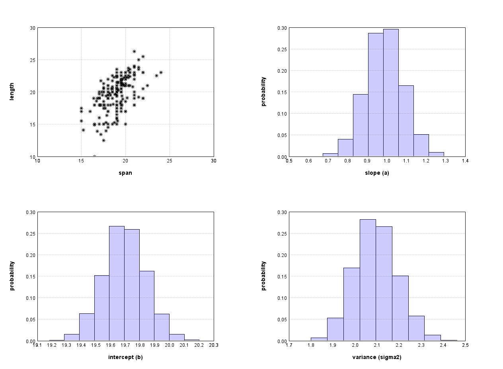

# Bayesian linear regression

In the previous video we have already seen the basic principle of Bayesian inference.
We have factored the joint distribution $$p(l,s)$$ as
$$
p(l, s) = p(s|l)p(l)
$$

and specified a distribution for each factor. By specifying these distributions we have encoded
our assumptions and beliefs about the modelled variables.
Once a measurement of the span became available, it was a simple matter of using Bayes rule to
compute the posterior distribution $$p(l | s)$$, and thus to formally update our beliefs in light of
this new data.

A crucial step in our modelling was the likelihood function. We just assumed that
$$p(l | s) = N(l, 9)$$, i.e. that the value we observe for the length is also the
mean for the span. However, we usually don't know the exact relationship and would rather like
to use data to estimate how the measurements are related. This is what Bayesian linear regression allows us to do.

In this article we start by exploring the Bayesian linear regression model on the simple example of modelling the length and the span of the hand. In a second step we show how this model can be used to
in the context of 3D shape model fitting using Gaussian Process Morphable Models.

### Bayesian regression of 2D hands

A widely used model for learning a relationship between two or more variables is the linear regression model.
In this model, the (mean-free) span $$s$$ is assumed to be a linear function of the  length $$l$$, perturbed by Gaussian noise $$\epsilon \sim N(0, \sigma^2)$$:
$$
s = a \cdot (l - \overline{l}) + b + \epsilon.
$$
Here the slope $$a$$, intercept $$b$$ and noise variance $$\sigma^2$$ are parameters of our model. $$\overline{l}$$ denotes the mean length. Subtracting the mean makes it easier to interpret the intercept parameter, as we know that the intercept corresponds exactly to the span for the mean hand.

These modelling assumptions lead to the following likelihood function:
$$
p( s | a, b, \sigma^2, l) = N(a \cdot (l - \overline{l}) + b, \sigma^2).
$$
Note that the difference compared to the previous version is, that we have introduced the parameters $$a$$, $$b$$ and $$\sigma^2$$. For fixed values of these parameters, we would be back at the model that we discussed in the video. But our goal here is to estimate the distribution of the parameters $$a, b$$ and $$\sigma^2$$, which
characterize the dependency between the span and length are. Thus we need a model of the joint distribution
$$p(a, b, \sigma^2, l, s)$$, which we factorize as follows:[1](#regression-footnote)

$$
p(a,b, \sigma^2, l, s) = p(a)p(b)p(\sigma^2)p(s| a, b, \sigma^2, l)
$$

To complete our model, we need to specify our prior beliefs about the parameters, by specifying $$p(a)$$, $$p(b)$$ and $$p(\sigma^2)$$.I believe, for example, that the span is approximately the same as the length irrespective of the length of the hand. I also assume that the noise parameter $$\sigma^2$$ is positive and rather small. These beliefs can be encoded using the following prior distributions:
$$
\begin{array}{l}
a \sim N(1, 1) \\
b \sim N(0, 2) \\
\sigma^2 \sim logNormal(0, 0.25)
\end{array}
$$
Note that these are just my prior beliefs. Somebody else could assign different distributions.

Bayes rule states that for a given observations $$l, s$$ we have
$$
p(a, b, \sigma^2 | s, l) = \frac{p(a)p(b)p(\sigma^2) p(l | a, b, \sigma^2, s)}{\int_{a} \int_{b} \int_{\sigma^2} p(a)p(b)p(\sigma^2) p(l| a, b, \sigma^2, s) \, da \, db \, d\sigma^2}
$$
Under the assumptions that the observations are i.i.d. and thus the likelihood of observing the data is simply the product of the
individual likelihoods, the posterior for a set of given observations $$(s_i, l_i), i = 1, \ldots, n$$ becomes
$$
p(a, b, \sigma^2 | s_i, l_i) = \prod_{i=1}^n \frac{p(a)p(b)p(\sigma^2) p(l_i | a, b, \sigma^2, s_i)}{\int_{a} \int_{b} \int_{\sigma^2} p(a)p(b)p(\sigma^2) p(l_i | a, b, \sigma^2, s_i) \, da \, db \, d\sigma^2}
$$
This posterior distribution reflects our beliefs about the parameters after we have seen the data.

While it is difficult to compute the posterior distribution analytically, writing computer
programs that compute an approximate posterior distribution is relatively simple. We will learn how to dow it in the next week. Here we just show report the result of the computation.
Figure 1 shows the distribution of possible parameter values of a and b after we have observed the  data shown in Figure 1. 

 <figcaption>Figure 1: Estimated Distribution of the parameters using the data shown in the 
upper left plot. </figcaption>

### Bayesian regression for 3D shape modelling

Assume now that we have a deformation model in low-rank form, as discussed in
week 5 of the FutureLearn course:
$$
u[\alpha](x) \sim \mu(x) + \sum_{i=1}^r \alpha_i \sqrt{\lambda_i} \varphi_i(x).
$$
Recall that if $$(\lambda_i, \varphi_i)$$ are the eigenfunction/eigenvalue pair of the covariance operator associated with the Gaussian process $$GP(\mu, k)$$. If
$$\alpha_i \sim N(0, 1)$$, then $$u$$ is distributed according to $$GP(\mu, k)$$.
We assumed that any target shape can be generated by applying
a deformation field with the appropriate coefficients $\alpha$. More precisely,
the correct deformation that relates a point $$x_i^T$$ of a given target surface $$\Gamma_T$$  with the corresponding point on the reference surface $$x_i^T$$ is given by
$$
x_i^T = x_i^R + u[\alpha](x_i^R) + \epsilon = x_i^R + \mu(x_i^R) + \sum_{i=1}^n \alpha_i \sqrt{\lambda_i} \varphi_i(x_i^R) + \epsilon
$$
where
$$
\epsilon \sim N(0, \sigma^2 I_{3 \times 3})
$$
is Gaussian noise.
We recognize that this is another linear regression model, as it is linear in the parameters $\alpha_i$.
The corresponding likelihood function is
$$
p(x_i^T | \alpha, x_i^R, \sigma^2) = N(x_i^R + u(x_i)[\alpha], \sigma^2) = N(x_i^R + \mu(x_i^R) + \sum_{j=1}^r \alpha_j \sqrt{\lambda_j} \varphi_j(x_i^R), \sigma^2).
$$
The prior on the shape parameters is, by assumption above,
$$
p(\alpha) = N(0, I_{r \times r}).
$$
For the noise term, we use a log-normal distribution as before
$$
p(\sigma^2) = logNormal(0, 0.25)
$$

It turns out that this is exactly the setting of Gaussian process regression that we discussed in the previous course. However, with this formulation, we hope that it is now easy to see how we can generalize it to include more parameters, change the assumption about the noise or form or the likelihood function, or even relax the assumption of
strict correspondence. In all the cases, a closed form solution will not be available anymore
and we will have to resort to computational methods.

#### Footnotes
<a name="regression-footnote">1</a>: Note that in this model we do not explicitly model uncertainty on l. This is the common assumption in Bayesian linear regression. For a justification and discussion, see e.g. [Bayesian Data Analysis](http://www.stat.columbia.edu/~gelman/book/), by Gelman et al, Page 354ff.
