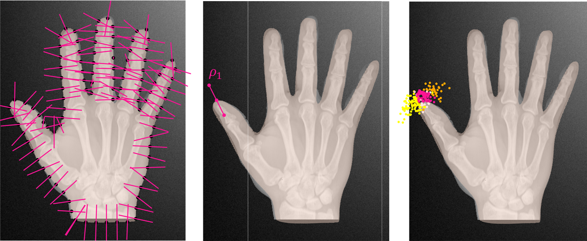

# Analyzing shapes in images using Active Shape Models.

In this article, we show how we can use ideas from the Active Shape Model 
algorithm, which was originally propose by Cootes and Taylor[1](#cootes-footnote)
in a Bayesian setting. The idea is straight-forward. We use learned profile distributions, 
which describe how the image in a given environment around a point looks like, to 
formulate a likelihood function. Once we have found suitable model parameter, which make 
the synthesized shape coincide with the shape represented in the image, the image should look similar
to the learned profiles at these points, resulting in a high value for the likelihood.
In contrast, if our model parameters
do not represent the points, the image likely looks different from the learned environment and is thus unlikely. 

### Active shape models revisited

In this section we describe this idea in more detail. 

Let $I : \Omega \to \mathbb{R}$ be an image and $\rho_I : \Omega \to \mathbb{R}^n$ a feature extractor, 
which yields for each point $x \in \Omega$ a feature vector $\rho_I(x)$. This feature vector characterizes
a neighborhood around the point in the image. In Active Shape Models, the feature is often just a probe
of the intensities at equidistant points on a line around the point $x$ (see Figure 1). 

Let $x_1, \ldots, x_k \subset \Gamma_R$ be 
a number of profile points, which we select on the reference shape. For each profile point $x_k$ we assign a feature distribution $\rho_k \sim N(\mu_k, \Sigma_k)$. This distribution 
should represent the variations we observe in the intensity along a profile line attached to $x_k$. It is usually learned from a set of feature vectors $\rho_{I_i}(x_k), i=1,\ldots, m$ which are extracted from training images $I_1, \ldots, I_m$. 

For a given image $I$, he probability of observing for the $k-$th profile point a feature vector $\rho_I(x)$ is given by
$$
p(\rho_I(x)) = N(\mu_k, \Sigma_k).
$$

<figcaption>ASM profiles on a hand contour (left). A profile defines a number of 
points usually along a line, where the features are extracted (middle). The likelihood of observing
the trained profile points for different test points in the environment (right)</figcaption>  

### A likelihood from Active Shape Models

Let $$\theta =(\alpha_1, \ldots, \alpha_n, \phi, \theta, \psi, t_x, t_y, t_z)$$ be the parameters of our 
shape model, 
consisting of the shape coefficients $$\alpha_1, \ldots, \alpha_r$$, the Euler angles $$\phi, \theta, \psi$$ 
and the translation parameters $$t_x, t_y, t_z$$. Given these parameters, we know for each profile point $x_k$ define in the model that it is mapped to $x_k(\theta) = R_{\phi,\theta, psi}[x_k + u[\alpha](x_k)] + t$.

After these discussion, it is now straight-forward to define the likelihood. For a single profile point $x_k$ the likelihood is
$$
p(\rho_I(x_k(\theta)) | \theta, x_k)=N(\mu_k, \Sigma_k).
$$

Assuming independence, the final likelihood is given by

$$ 
p(\rho_I(x_1(\theta)), \ldots, \rho_I(x_n(\theta)) \,|\, \theta, x_1, \ldots x_k) = \prod_{i=1}^n N(\mu_k, \Sigma_k)
$$

### Bayesian inference using the Active Shape Model likelihood

Given the likelihood, we can apply our strategy for shape model fitting to fit shapes represented as images.  The considerations regarding the priors over the parameters do not change compared to surface fitting. The Metropolis-Hastings algorithm will allow us to obtain samples from the posterior. 
Each sample represent a possible segmentation of the image. 

When we use many profile points, we expect the posterior distribution to be sharply peaked around the true
contour. This is expected, as when the contour is clearly defined, there is not much uncertainty. 
Unfortunately such peaked likelihoods are difficult to fit. The reason for this is, that the posterior density changes rapidly, and even small steps can result in a sharply changing density value and hence be rejected. Converging to a local mode of the distribution can also get the chain stuck.
Overcoming this difficulty requires that we carefully define our priors, to include as much information 
about the problem as possible. We also need to carefully tune our proposals. 
A possibility to make the fitting problem easier is to combine this likelihood with other information, such as manually clicked contour points or landmark points, which steer the distribution towards the
right model. Another strategy, which works well in practice is, to run several Metropolis-Hasting Chains in sequence. In the first sequence only few profile points are
used. In the following chains, the number of profile points are increased gradually. This has the effect that the posterior distribution is at the beginning rather flat, but gets more peaked with time. The hope is that this strategy avoids many of the local modes and converges to the true mode. 

A more in depth discussion, as well as results for a real segmentation task are provided in the paper
by Morel et al. [2](#morel-asm)

#### References
* <a name="cootes-asm">1: </a>Cootes, Timothy F., et al. "Active shape models-their training and application." Computer vision and image understanding 61.1 (1995): 38-59.
* <a name="morel-asm">2: </a>Morel-Forster, Andreas, et al. "Probabilistic fitting of active shape models." International Workshop on Shape in Medical Imaging. Springer, Cham, 2018.

