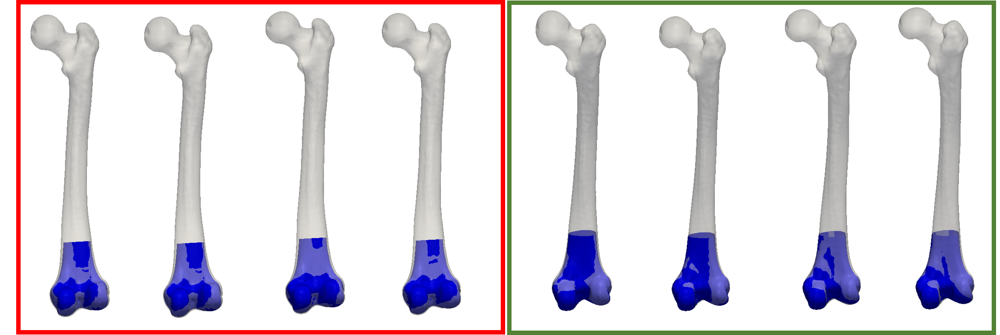
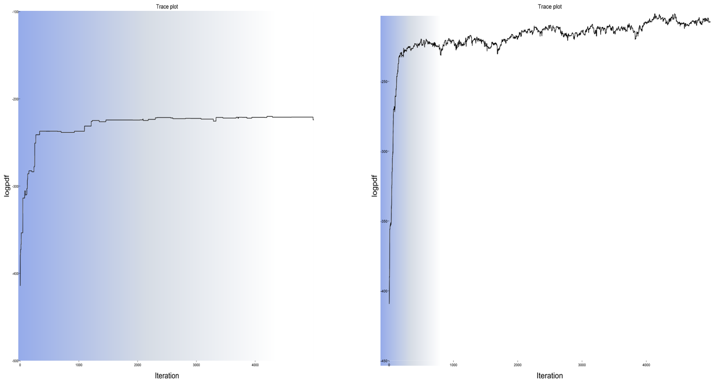

# Detecting problems in the sampler

Let's assume that we have specified our model and also set up a sampler by defining proposal distribution  for the Metropolis-Hastings algorithm. This is all we need and we can start drawing samples from the posterior distribution. Irrespective of how challenging our problem is, and whether we have chosen appropriate proposal distributions, the Metropolis-Hastings algorithm will always happily produce some samples. The question is, whether these samples are really samples from our desired target distribution. 
This property is guaranteed when we sample for infinitely long time, but for any finite amount of time we 
need some diagnostics to really find out. 

In this article we discuss how we can
1. make sure the samples follow the target distribution
2. check that the proposals we use are efficient in producing samples.

Step 2 is necessary, because even if our chain eventually converges to the target distribution, it does not imply that all the proposals we have specified are efficient at proposing likely next states. The reason is that the Metropolis-Hastings algorithm will simply reject proposed samples that are not likely. 

### Visualizing samples from the posterior

The first, most simple but also most crucial step in diagnosing the chain is visualizing samples from the posterior. We sample parameters from the posterior distribution, use them to synthesize a surface and visualize them together with the target data.

Figure 1 shows samples from a posterior, where the observations are given partial femura. We can see on the left samples from a chain that did not properly work. The samples do not properly match the target. Also the reconstruction do not show the expected variability in shape. In contrast, the samples shown on the right look better. We have a bigger variability in the shape of the femoral head, and at the same time the match of the observations is better. 

<figcaption>Figure 1: Visual comparison of samples from the posterior distribution. Left: A rather bad fit, together with missing variability shows a failure in converging. Right: Samples from a chain, which are closer to what we would expect posterior samples to look like.</figcaption>

#### Side note : Fitting samples generated from the prior

That our model does not properly fit the target could either be because the sampler does not properly work, or that the model is not able to actually explain the target data. As our model is fully generative, 
there is a simple way to test this: We can generate samples from the prior, and use the corresponding parameters to synthesize shapes, which we then try to fit. As the samples are directly generated using our model, we know that a failure in explaining the observations is necessarily due to a deficient sampler.

### Trace plots

Another diagnostic tool in our hand are trace plots. A trace-plots simply plots the log-density value 
of the posterior distribution in every iteration. A trace-plot for our unsuccessful fitting run is 
shown in Figure 2 (left). The blue shaded are depicts the burn-in phase. We see that for this unsuccessful run, the posterior increases almost monotonically, which means that it either it is still in the burn-in phase or it is not able to explore the distribution. Typically this happens, when the proposals make such big steps that all new samples which have a lower probability are so much more unlikely, that they are never accepted. 
Contrast this with a more successful run (Figure 2, right). After the burn-in phase, the sampler converges, and produces a wider variety of samples: sometimes lower-probability areas are explored and sometimes samples with higher probability are produced. 

<figcaption>Figure 2: Traceplots for a sampler that is not properly set up (left) and a better tuned sampler (right). The blue-shaded area depicts the burn-in phase.</figcaption>

### Acceptance rates

One factor that complicates diagnosing problems with Metropolis-Hastings chains is the nature of the Metropolis-Hastings algorithms itself: As previously discussed, the Metropolis-Hastings algorithm implements a propose and verify strategy. A solution is proposed and, in a second step, verified to be a plausible next sample. This makes the strategy robust, but also implies
that we could end up with proposals that are rejected most of the times, while the sampler still produces a good approximation of the target distribution. Although we get at the end the desired solution, the sampler is still less efficient than it should be. 

The easiest way to diagnose this problem is to log the acceptance and rejections of a sample and then compute diagnostics based on it. A particular simple one is the accept/reject ratio. If this ratio is low, 
we know that the corresponding proposal is likely to be inefficient and we may want to change its parameters. What the ideal accept/reject ratio is, depends on the proposal. For a simple random walk proposal, it can be shown that the most efficient chains accepts the sample around 20% of the time.<a href="#gelman-convergence">3</a>. For other proposal, the optimal rates could be very different. If a proposal step is expensive to compute, we expect it to more often produce a good update step. It should therefore lead to a much higher acceptance rate. Note however, that an acceptance rate of 100% is also not desireable. This would mean that the proposal is accepted every time, effectively proposing only proposals in a direction of increasing probability. For such proposal, the algorithm would degenerate into a hill-climbing algorithm, and eventually get stuck in a local optimum, unable to explore the full distribution. 

In our example, the acceptance rate for the unsuccessful case, we have the following acceptance rats:

| Proposal | Acceptance rate | 
|----------|-----------------|
| Shape update | 0.008 |
| Noise update |  0.1  | 
| Translation update |  0.0 |
|  Rotation update | 0.0 |

We see that only the noise update proposal did produce successful updates, the shape update was rarely accepted and the pose updates did not succeed at all. This might have likely led to the effect that the noise was driven higher, allowing for solutions that were farther away from the true solution. Every now and then the shape update succeeded, resulting in  a fit that at least superficially looks like an explanation of the observation. 

#### References
* <a name="betancour">1: </a>Betancourt, M. "Towards a principled Bayesian workflow." <a href="https://betanalpha.github.io/assets/case_studies/principled_bayesian_workflow.html">https://betanalpha.github.io/assets/case_studies/principled_bayesian_workflow.html</a>
* <a name="gelman">2: </a>Gelman, Andrew et al. "Bayesian workflow." arXiv preprint arXiv:2011.01808 (2020)
* <a name="gelman-convergence">3: </a> Gelman, Andrew, et al. "Weak convergence and optimal scaling of random walk Metropolis algorithms." The annals of applied probability 7.1 (1997): 110-120.