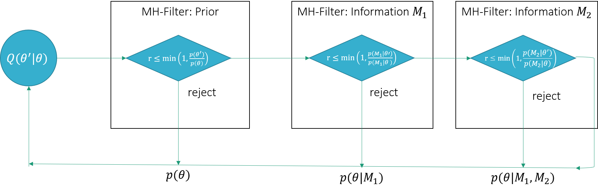

# Metropolis filter proposal

In this article we will discuss the Metropolis Filter proposal. This proposal is useful, 
when our likelihood is made up of individual parts, which have different computational cost to be evaluated. It allows us to reject unlikely samples early, i.e.  without having to 
compute all the parts of the likelihood. A typical scenario where this proposal is useful is, when 
we integrate in a fitting algorithm landmark annotations (cheap to evaluate), contour points (relatively cheap to evaluate) and an ASM likelihood (expensive to evaluate). 

### Mathematical idea

Let's assume that we have a likelihood that consists of the following independent factors
$$
p(M_1, M_2 | \theta) = p(M_1 | \theta) p(M_2 | \theta)
$$
where $M_1, M_2$ are pieces of information that we observe. 

The posterior $p(\theta | M_1, M_2)$ can be computed sequentially by starting from the prior
and taking in new information from the likelihood one by one, leading to the chain:

$$
p(\theta) \stackrel{p(M_1 | \theta)}{\rightarrow} p(\theta | M_1) \stackrel{p(M_2 | \theta)}{\rightarrow} p(\theta | M_1, M_2)
$$
or written explicitly as
$$
p(\theta | M_1, M_2) = \frac{1}{Z} p(\theta ) p(M_1 | \theta) p(M_2 | \theta)  = \frac{1}{Z'}p(\theta | M_1)p(M_2 | \theta),  
$$
where $Z, Z'$ are the usual normalization factors. 

This sequence of updates can be implemented efficiently using the Metropolis-Hastings algorithm. We start sampling from the prior distribution. The resulting sample is *filtered* by the likelihood $p(M_1 | \theta)$, which is then subsequently *filtered* by the likelihood $p(M_2 | \theta)$. Filtered here means that  the sample from the prior distribution becomes subject to another acceptance rejected step, where the acceptance step is computed using the corresponding likelihood. The idea is illustrated in Figure 1

<figcaption>Figure 1: Illustration of the Metropolis-filter.</figcaption>

It can be shown that this procedure converges to the desired posterior distribution $p(\theta | M_1, M_2)$ (see e.g. Schönborn, Section 5.3.4<sup><a href="schoenborn-thesis">1</a></sup>). The advantage of this implementation is clear: We do not have to compute the likelihoods in the later stages when a sample is already rejected in the first step of the filtering algorithm. 


### Implementation in Scalismo

The practical implementation of this filtering step is straight-forward. We simply create a special proposal, which internally runs one step of the Metropolis-Algorithm. In Scalismo, this is already implemented. It can be used as follows 
```scala
val priorEvaluator : DistributionEvaluator[Sample] = ???
val proposalGen : ProposalGenerator[Sample] = ???

val metropolisFilterProposalGen1 = MetropolisFilterProposal(proposalGen, priorEvaluator)

val likelihoodEvaluator1 : DistributionEvaluator[Sample] = ??? 
val metropolisFilterProposalGen2 = MetropolisFilterProposal(metropolisFilterProposalGen1, likelihoodEvaluator1)

val likelihoodEvaluator1 : DistributionEvaluator[Sample] = ??? 
val mh = MetropolisHastings(metropolisFilterProposalGen2 , likelihoodEvaluator2)
```

### References

* <a name="schoenborn-thesis">1</a> Schönborn, Sandro. Markov chain Monte Carlo for integrated face image analysis. Diss. University_of_Basel, 2014.
