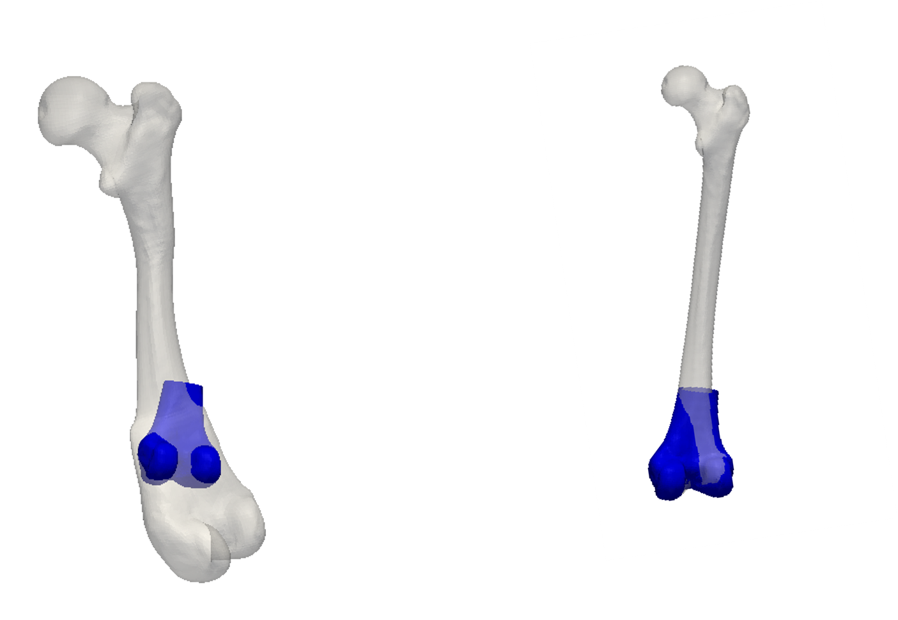

# Simple sampling strategies for shape model fitting

In this article we discuss two simple strategies for designing sampling chains using the Metropolis-Hastings algorithm. The first ones is the use of mixture proposals, and the second one
is running several chains in sequence. 

### Mixture proposal and block-wise sampling

The main idea behind mixture proposals is simple: Given $n$ different proposals $Q_1(\theta' | \theta), \ldots, Q_n(\theta' | \theta)$  , each mapping a state $\theta$ to a new state $\theta'$, we can create a new proposal 

$$Q_M(\theta'| \theta) = \sum_{i=1}^n \lambda_i Q_i(\theta' | \theta)$$

with $\sum_{i=1}^n \lambda_i = 1,\, 0 < \lambda_i \le 1$. Here, a proposal $Q_i(\theta'|\theta)$ is selected randomly with a probability $\lambda_i$. 

Using these different proposals, we can bring variety into our proposals and achieve a mixture of different behaviors. The hope is that the mixture leads to an exploration of the space which is more efficient than what any single proposal alone could achieve. 

Mixture proposals give rise to two main strategies: Block-wise proposals and multi-scale proposals.

#### Block-wise proposal

In shape model fitting applications, we are usually dealing with a high-dimensional parameter space. That a model has 200 parameters or more is not untypical. Due to the curse of dimensionality, perturbing all the parameters at once is likely to sharply change the density value and hence lead to rejection of the proposed sample. The idea behind block-wise proposals is to update only a part of the parameter space 
at once. Assume for example that the parameter vector $\theta =(t_x, t_y, t_z, R_\psi, R_\theta, R_\rho, \alpha_1, \ldots, \alpha_n)$ consists of translation parameters $t_x, t_y, t_z$, rotation parameters $R_\psi, R_\theta, R_\rho$ and parameters for the shape model coefficients $\alpha_1, \ldots, \alpha_n$. We might 
design a proposal $Q_t$, which only updates the translation parameters, one proposal $Q_R$ which only updates rotation parameters and a proposal $Q_\alpha$, which only updates the shape parameters. The final proposal would then be the mixture proposal 

$$
Q_M(\theta'|\theta) = \lambda_t Q_t(\theta | \theta') + \lambda_R Q_R(\theta | \theta') + \lambda_\alpha Q_\alpha(\theta | \theta'), 
$$
where $\lambda_t, \lambda_R, \lambda_\alpha$ determine the probability with which each of the proopsals is 
selected. Of course, each individual proposal could again internally be decomposed as a mixture of lower-dimensional proposals.

### Running several chains in sequence

As already discussed, in shape model fitting we are usually dealing with a complicated, multi-modal 
posterior distribution. When our sampler starts of far away from the real mode, it is likely to get 
stuck in a local mode, far away from the true mode. Especially when we are in a high-dimensional setting, the model might adjust rather well to this solution, with the consequence that the probability of 
ever leaving it is close to zero. 

This problem can be mitigated by running a sequence of sampling chains, where the first sequences adjust
only a subset of the parameter space. For example, we might start by running a chain, which only adjust the pose parameters (i.e. translation and rotation). Once this chain has converged and the samples are (hopefully) concentrated in the mode that contains the global maximum, we can start a second chain, which can also adjust shape parameters. 

This situation is illustrated in Figure 1. On the left we see the result
of a chain, where we start far away from the true distribution, but adjust all parameters at once. We see 
that the model compensates the bad pose fit by changing the shape, leading to a convergence into a local optimum. The result on the right is achieved from the same starting position, but where only 
translation and rotation was updated. As the differences cannot be compensated by changing the shape, 
the pose eventually converges to the correct pose. Starting a second chain from this new position, where 
also shape and noise are updated, will lead to the desired posterior distribution. 

The idea of running several chains in sequence does not only help to avoid getting stuck in a local mode, but can also be used to increase convergence. We can start sampling from a chain that makes rather large steps and hence explores the space widely, whereas at some point we switch to a chain, which makes smaller steps to explore the local mode 
we are in. 

# References
* <a name="schoenborn-thesis">1</a> Schönborn, Sandro. Markov chain Monte Carlo for integrated face image analysis. Diss. University_of_Basel, 2014.
* <a name="schoenborn-ijv">2</a> Schönborn, Sandro, et al. "Markov chain monte carlo for automated face image analysis." International Journal of Computer Vision 123.2 (2017): 160-183.